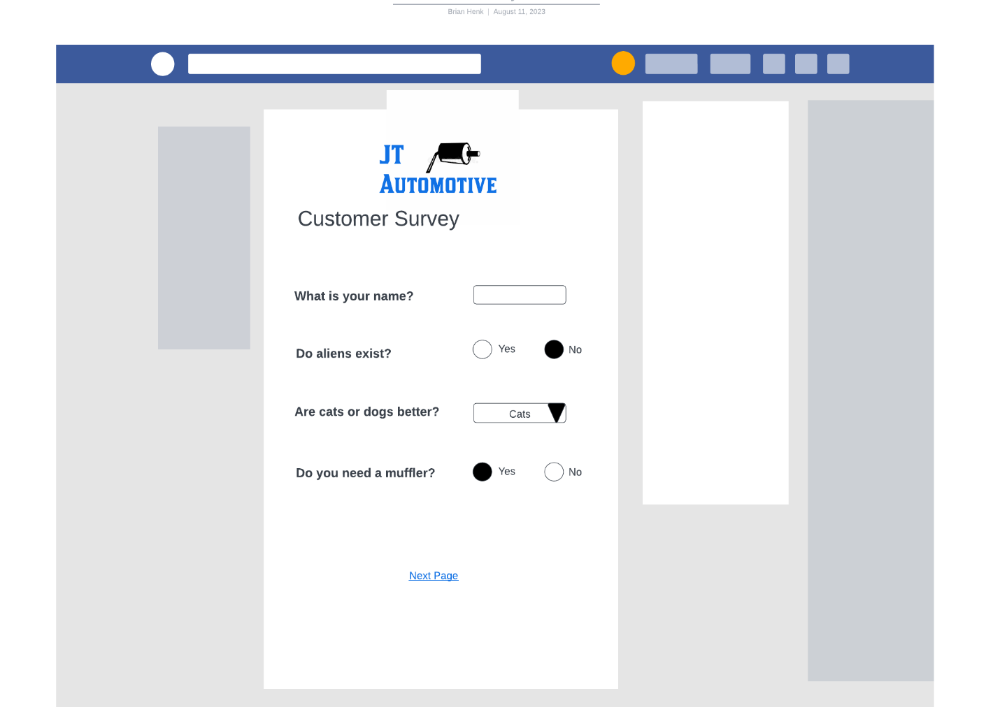

# Assessment: Candidate Screening – ReactJS Architectural Design

## Description

Please prepare an analysis (either written or code) of how you would architect a multi-page questionnaire application using React JS. Assume the questionnaire could consist of yes/no radio buttons, textboxes, and dropdowns. The question-and-answer information would come from an API and would need to be rendered. The application will be used by many different clients and each one will want their logo at the top of the questionnaire and their company colors and fonts used throughout.
Here is an example of what it might look like:



Additional considerations include:

- Security considerations, encryption on sensitive data
- How to handle CSS and logo styling that can differ per client
- How to maintain previously answered questions when traversing to previous page

Please be prepared to discuss your thought process and considerations with the development team during the interview.

Sample payload from API:

```
{
	"questions": [
		{
			"Id": 1,
			"ControlType": "Label",
			"Text": "Lets begin the Survey!",
			"PageNumber": 1,
			"answers": []
		},
		{
			"Id": 2,
			"ControlType": "TextBox",
			"Text": "FirstName",
			"PageNumber": 1,
			"answers": []
		},
		{
			"Id": 3,
			"ControlType": "TextBox",
			"Text": "LastName",
			"PageNumber": 1,
			"answers": []
		},
		{
			"Id": 4,
			"ControlType": "DatePicker",
			"Text": "Date Of Birth",
			"PageNumber": 1,
			"answers": []
		},
		{
			"Id": 5,
			"ControlType": "TextBox",
			"Text": "Email",
			"PageNumber": 1,
			"answers": []
		},
		{
			"Id": 6,
			"ControlType": "Label",
			"Text": "Do you have any pets? ",
			"PageNumber": 2,
			"answers": [
				{
					"id": 1,
					"text": "Yes",
					"answerType": "RadioButton"
				},
				{
					"id": 2,
					"text": "No",
					"answerType": "RadioButton"
				}
			]
		},
		{
			"Id": 7,
			"ControlType": "Label",
			"Text": "Do you listen to music while you work?",
			"PageNumber": 2,
			"answers": [
				{
					"id": 1,
					"text": "Yes",
					"answerType": "RadioButton"
				},
				{
					"id": 2,
					"text": "No",
					"answerType": "RadioButton"
				}
			]
		}
	],
	"SupportedLanguages": [
		{
			"languageCode": "en-US",
			"languageDescription": "English Language",
			"defaultLanguage": true
		},
		{
			"languageCode": "zh-CN",
			"languageDescription": "Chinese (Mandarin)",
			"defaultLanguage": false
		}
	]
}
```
